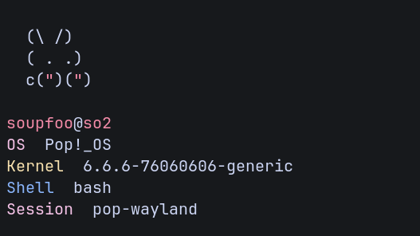

<h1>soupfet</h1>

> A tiny system information tool for Linux



## Installation
from source:
```
git clone https://github.com/soupfoo/soupfet.git
cd soupfet
go build
./soupfet
```
You can download a prebuilt binary from [releases page](https://github.com/soupfoo/soupfet/releases) as well.

## License
soupfet is licensed under the MIT license. See [LICENSE](./LICENSE) for details.